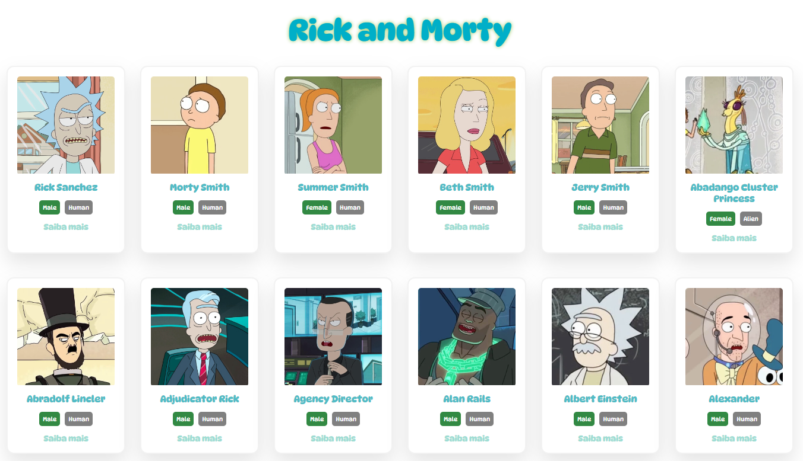
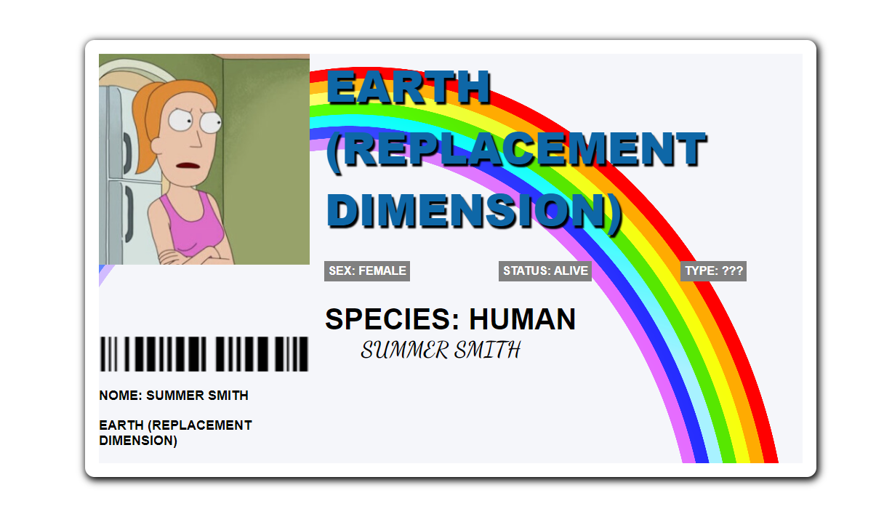

# Rick and Morty API
Projeto para aprender a lidar com rotas e consumo de API usando React

## 🏠 Home:

## 🔗 Rota Dinâmica:

## Features:

- [x] Lista personagens
- [x] Cards Personagens
- [ ] Lista de Episódios
- [ ] Barra de pesquisa

## Tools:
- React
- [React Router](https://reactrouter.com/)
- [Style Component](https://styled-components.com/)
